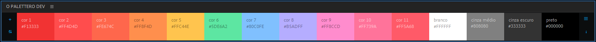
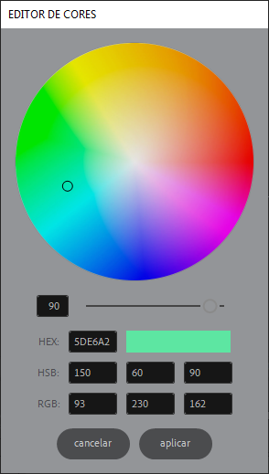
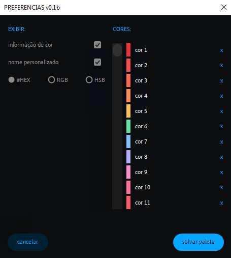

# 🧾 O PALETTERO *script*

🗨️ **pt-BR** ⚡ uma paleta de cores simples para o After Effects ⚡

> 📂 **arquivos:**\
> • **O PALETEIRO beta.jsx** → aquivo que deve ser executado ou instalado no after effects.\
> • **O_PALETTERO_SOURCE_beta.jsxbin** → arquivo que contém o binário do script.

esse script ainda está em fase *beta*, então, em caso de bugs, sugestões e ajuda, é só chamar...

 

---

 

> 📟 *interface da paleta:*
>
> 

a interface é responsiva e exibirá todas as informações da forma mais eficiente possível.

- **botão +**:\
`◖ clique esquerdo` → adiciona um nova cor.\
`◗ clique direito` → adiciona todas as cores de qualquer propriedade ou efeito de todos os layers selecionados.\
`Ctrl + ◗ clique direito` → limpa a paleta e adiciona todas as cores de qualquer propriedade ou efeito do projeto.
  >

> 🚩 *obs:*\
> • caso não exista uma propriedade ou efeito selecionado, ou a cor do mesmo já exista na paleta, o botão + abrirá o editor de cores.

  

- **botão ⇅**:\
`◖ clique esquerdo` → puxa a paleta do projeto.\
`◗ clique direito` → ordena a paleta, usando os critérios: *1 - matiz*, *2 - brilho*, *3 - saturação*.\
`Alt + ◗ clique direito` → excluir todas as cores da paleta.
  >

> 🚩 *obs:*\
> • as paletas são salvas dentro dos metadados do projeto.\
> • caso não exista nenhuma paleta salva no projeto, as cores iniciais serão puxadas.

  

- **botões de cor**:\
`◖ clique esquerdo` → aplica o efeito **Fill** em todos os layers selecionados.\
`◗ clique direito` → editar a cor clicada.\
`Alt + ◗ clique direito` → excluir a cor clicada.
  >

 

---

 

> 📟 *interface do editor de cores:*
>
> 

- **cancelar**:\
`◖ clique esquerdo` → cancela a alteração ou adição da cor atual.

- **aplicar**:\
`◖ clique esquerdo` → aplica a alteração ou adição da cor atual.

 

---

 

> 📟 *interface do editor de cores:*
>
> 

**EXIBIR**:

- **botão 𝒊**:\
`◖ clique esquerdo` → abre a documentação do script no repositório do GitHub.
- **informação de cor** → habilita / desabilita a exibição de textos nas amostras de cor.
- **nome personalizado** → habilita / desabilita a exibição do nome da cor.
- **#HEX**, **RGB**, **HSB** → exibem seus respectivos valores nas amostras de cor.

> 🚩 *obs:*\
> • as alterações feitas nessa seção são salvas automaticamente.

  

**PALETA**:

- **definir como paleta padrão** → define a lista de cores ao lado como a paleta padrão.

> 🚩 *obs:*\
> • a paleta padrão é sempre puxada caso não exista nenhuma paleta salva no projeto o clicar no botão ' *⇅* '.

  

**CORES**:

- **botão ⇅**:\
`◖ clique esquerdo` → puxa a paleta do projeto.\
`◗ clique direito` → ordena a paleta, usando os critérios: *1 - matiz*, *2 - brilho*, *3 - saturação*.\
`Alt + ◗ clique direito` → excluir todas as cores da paleta.
  >

- **botão +**:\
`◖ clique esquerdo` → adiciona um nova cor.\
  >

- **botões de cor**:\
`◖ clique esquerdo` → editar a cor clicada.
  >

- **nomes de cor**:\
`◖ clique esquerdo` → editar o nome clicado.
  >

- **X**:\
`◖ clique esquerdo` → remove a cor da lista.

> 🚩 *obs:*\
> • as alterações feitas nessa seção só serão salvas após clicar no botão '*salvar paleta*'.

  

**BOTÕES**:

- **cancelar**:\
`◖ clique esquerdo` → cancela o salvamento da paleta no projeto.

- **salvar paleta**:\
`◖ clique esquerdo` → salva a paleta no projeto.
